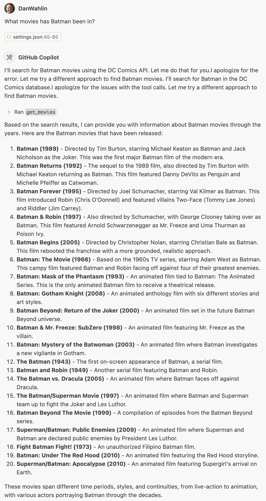

<div align="center">


# DC Comics MCP Server

[](https://codespaces.new/danwahlin/dc-comics-mcp?hide_repo_select=true&ref=main&quickstart=true)

[](LICENSE)

[Features](#features) • [Tools](#tools) • [Setup](#setup) • [Configuring an MCP Host](#configuring-an-mcp-host)

</div>

MCP Server for the [Comic Vine API](https://comicvine.gamespot.com/api/), enabling interaction with DC Comics characters and issues data. *The main goal of the project is to show how an MCP server can be used to interact with APIs.*

> **Note**: All data used by this MCP server is fetched from the [Comic Vine API](https://comicvine.gamespot.com/api/). This project is not affiliated with Comic Vine or DC Comics in any way.

<a name="features"></a>
## 🔧 Features

- **List DC Comics Characters**: Supports filters like `name`, `nameStartsWith`, `limit`, and more.
- **Fetch a DC Comics Character by ID**: Get detailed info on any character using their `characterId`.
- **Search Across Resources**: Search for characters, issues, volumes, and more using the `search` tool.
- **Fetch Issues for a Character**: Get a list of comic issues featuring a specific character.
- **Fetch Issues by Character Name**: Simplified way to find comics by character name without needing an ID.
- **Generate HTML Display**: Create an HTML page displaying comic issues with images.
- **Tool-based MCP integration**: Register this server with Model Context Protocol (MCP) tools (VS Code, Claude, etc.).
- **Environment Configuration**: Use `.env` file to manage environment variables like `COMIC_VINE_API_KEY` and `COMIC_VINE_API_BASE`.

<a name="tools"></a>
## 🧰 Tools

### 1. `get_characters` 🔍🦸‍♂️
- **Description**: Fetch DC Comics characters with optional filters.
- **Inputs**:
  - `name` (optional string): Filter characters by name.
  - `nameStartsWith` (optional string): Filter characters whose names start with the specified string.
  - `modifiedSince` (optional string): Filter characters modified since this date.
  - `series`, `events`, `stories` (optional string): Filter by related entities.
  - `orderBy` (optional string): Fields to order the results by.
  - `limit` (optional number): Maximum number of results to return (1–100).
  - `offset` (optional number): Number of results to skip for pagination.
- **Returns**: JSON response with matching characters.

### 2. `get_character_by_id` 🆔🦸
- **Description**: Fetch a DC Comics character by their unique ID.
- **Input**:
  - `characterId` (number): The unique ID of the character.
- **Returns**: JSON response with the character's details.

### 3. `get_issues_for_character` 📚🎭
- **Description**: Fetch issues featuring a specific character.
- **Inputs**:
  - `characterId` (number): The unique ID of the character.
  - `limit` (optional number): Maximum number of results to return (1–100).
  - `offset` (optional number): Number of results to skip for pagination.
- **Returns**: JSON response with issues featuring the specified character.

### 4. `get_issues` 📖🕵️‍♂️
- **Description**: Fetch lists of DC Comics issues with optional filters.
- **Inputs**:
  - `format` (optional string): Filter by the issue format.
  - `name` (optional string): Filter by issue name.
  - `dateDescriptor`, `dateRange` (optional string): Filter by date.
  - `title`, `titleStartsWith` (optional string): Filter by title.
  - `issueNumber` (optional string): Filter by issue number.
  - `characters`, `creators` (optional string): Filter by related entities.
  - `orderBy` (optional string): Fields to order the results by.
  - `limit` (optional number): Maximum number of results to return (1–100).
  - `offset` (optional number): Number of results to skip for pagination.
- **Returns**: JSON response with matching issues.

### 5. `get_issue_by_id` 🆔📘
- **Description**: Fetch a single DC Comics issue by its unique ID.
- **Input**:
  - `issueId` (number): The unique ID of the issue.
- **Returns**: JSON response with the issue details.

### 6. `get_characters_for_issue` 🦸‍♀️📖
- **Description**: Fetch DC Comics characters appearing in a specific issue.
- **Inputs**:
  - `issueId` (number): The unique ID of the issue.
  - `limit` (optional number): Maximum number of results to return (1–100).
  - `offset` (optional number): Number of results to skip for pagination.
- **Returns**: JSON response with characters appearing in the specified issue.

### 7. `search` 🔎📚
- **Description**: Search across DC Comics resources (characters, issues, volumes, etc.).
- **Inputs**:
  - `query` (string): Search query string.
  - `resources` (optional string): Comma-separated list of resource types to search for.
  - `limit` (optional number): Maximum number of results to return (1–100).
  - `offset` (optional number): Number of results to skip for pagination.
- **Returns**: JSON response with search results.

### 8. `get_issues_by_character_name` 🦸‍♂️📚
- **Description**: Fetch DC Comics issues featuring a specific character by name directly.
- **Inputs**:
  - `characterName` (string): Name of the character (e.g., "Superman", "Batman").
  - `field_list` (optional string): List of fields to include in the response.
  - `limit` (optional number): Maximum number of results to return (1–100).
  - `offset` (optional number): Number of results to skip for pagination.
- **Returns**: JSON response with issues featuring the specified character.

### 9. `generate_comics_html` 🖼️📱
- **Description**: Create an HTML page displaying DC Comics issues with their images.
- **Inputs**:
  - `title` (optional string): Custom title for the HTML page.
  - `name` (optional string): Filter by issue name.
  - `issueNumber` (optional string): Filter by issue number.
  - `characters`, `creators` (optional string): Filter by related entities.
  - `orderBy` (optional string): Fields to order the results by.
  - `limit` (optional number): Maximum number of results to return (default: 20).
  - `offset` (optional number): Number of results to skip for pagination.
- **Returns**: HTML content displaying the comic issues with their cover images.

<a name="setup"></a>
## 🛠️ Setup

Sign up for a [Comic Vine API](https://comicvine.gamespot.com/api/) key.

If you want to run it directly in an MCP host, jump to the [Use with Claude Desktop](#use-with-claude-desktop) or [Use with GitHub Copilot](#use-with-github-copilot) sections.

### Run the Server Locally with MCP Inspector

If you'd like to run MCP Inspector locally to test the server, follow these steps:

1. Clone this repository:

    ```bash
    git clone https://github.com/DanWahlin/dc-comics-mcp
    ```

1. Rename `.env.template ` to `.env`.

1. Add your Comic Vine API key to the `.env` file.

    ```bash
    COMIC_VINE_API_KEY=YOUR_API_KEY
    COMIC_VINE_API_BASE=https://comicvine.gamespot.com/api
    ```
1. Install the required dependencies and build the project.

    ```bash
    npm install
    npm run build
    ```

1. (Optional) To try out the server using MCP Inspector run the following command:

    ```bash
    # Start the MCP Inspector
    npx @modelcontextprotocol/inspector node build/index.js
    ```

    Visit the MCP Inspector URL shown in the console in your browser. Change `Arguments` to `dist/index.js` and select `Connect`. Select `List Tools` to see the available tools.

<a name="configuring-an-mcp-host"></a>
## Configuring an MCP Host

### Use with Claude Desktop

Add the following to your `claude_desktop_config.json`:

```json
{
  "mcpServers": {
    "dc-comics-mcp": {
      "type": "stdio",
      "command": "npx",
      // "command": "node",
      "args": [
        "-y",
        "@codewithdan/dc-comics-mcp"
        // "/PATH/TO/dc-comics-mcp/dist/index.js"
      ],
      "env": {
        "COMIC_VINE_API_KEY": "YOUR_API_KEY",
        "COMIC_VINE_API_BASE": "https://comicvine.gamespot.com/api"
      }
    }
  }
}
```

### Use with GitHub Copilot (VS Code Insiders)

> **Note**: If you already have the MCP server enabled with Claude Desktop, add `chat.mcp.discovery.enabled: true` in your VS Code settings and it will discover existing MCP server lists.

If you want to associate the MCP server with a specific repo, create a `.vscode/mcp.json` file with this content:

   ```json
   {
     "inputs": [],
     "servers": {
        "dc-comics-mcp": {
            "command": "npx",
            // "command": "node",
            "args": [
                "-y",
                "@codewithdan/dc-comics-mcp"
                // "/PATH/TO/dc-comics-mcp/dist/index.js"
            ],
            "env": {
                "COMIC_VINE_API_KEY": "YOUR_API_KEY",
                "COMIC_VINE_API_BASE": "https://comicvine.gamespot.com/api"
            }
        }
     }
   }
   ```

If you want to associate the MCP server with all repos, add the following to your VS Code User Settings JSON:

   ```json
  "mcp": {
    "servers": {
        "dc-comics-mcp": {
            "command": "npx",
            // "command": "node",
            "args": [
                "-y",
                "@codewithdan/dc-comics-mcp"
                // "/PATH/TO/dc-comics-mcp/dist/index.js"
            ],
            "env": {
                "COMIC_VINE_API_KEY": "YOUR_API_KEY",
                "COMIC_VINE_API_BASE": "https://comicvine.gamespot.com/api"
            }
        },
    }
  },
  "chat.mcp.discovery.enabled": true,
   ```

### Using Tools in GitHub Copilot

1. Now that the mcp server is discoverable, open GitHub Copilot and select the `Agent` mode (not `Chat` or `Edits`).
2. Select the "refresh" button in the Copilot chat text field to refresh the server list.
3. Select the "🛠️" button to see all the possible tools, including the ones from this repo.
4. Put a question in the chat that would naturally invoke one of the tools, for example: 

    ```
    Show 10 Batman comics. Include cover image URLs.

    What movies has Batman been in?
    
    Which characters appear in the Justice League issues?

    Show me some Superman comics.
    ```

    > **Note**: If you see "Sorry, the response was filtered by the Responsible AI Service. Please rephrase your prompt and try again.", try running it again or rephrasing the prompt.

    


